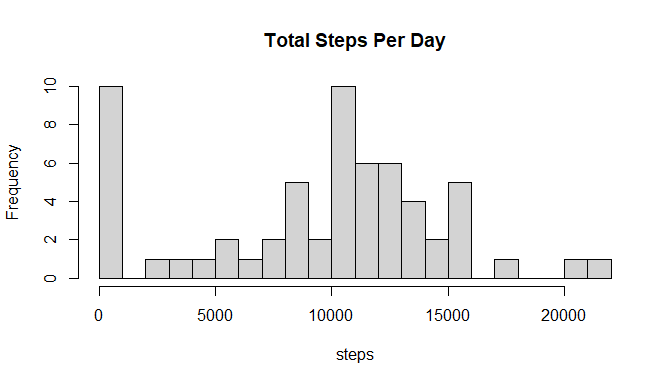
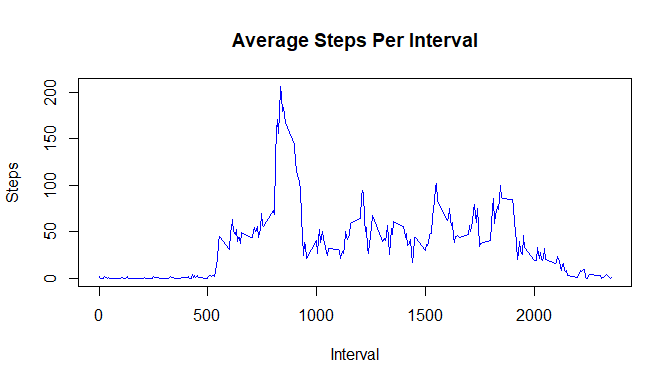
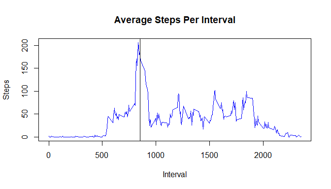
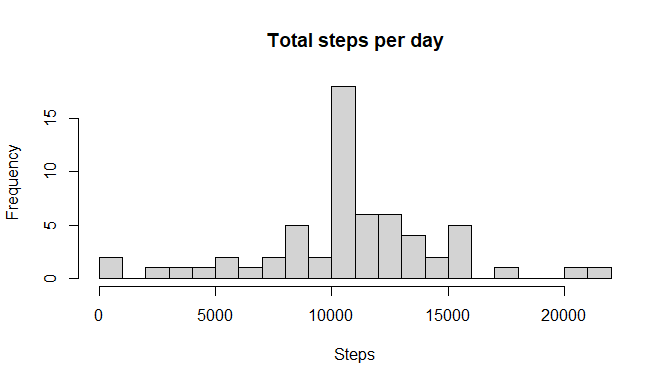
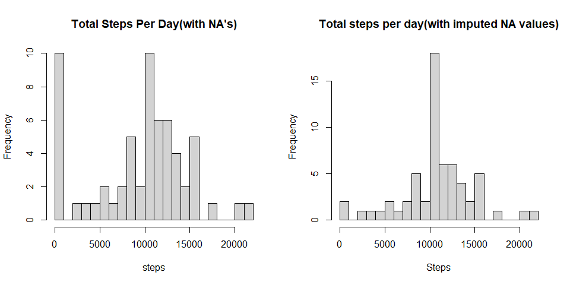
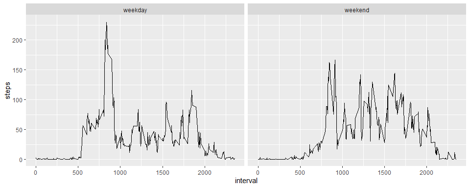

---

title: "Reproducible Research: Peer Assessment 1"

output: 

  html_document:

    keep_md: true

---
Activity Monitoring 
======================

### 1.Loading and Pre-processing Data
- Let's read the data


```r
data <- read.csv("./activity/activity.csv")
origData<-data
print(head(data))
```

```
##   steps       date interval
## 1    NA 2012-10-01        0
## 2    NA 2012-10-01        5
## 3    NA 2012-10-01       10
## 4    NA 2012-10-01       15
## 5    NA 2012-10-01       20
## 6    NA 2012-10-01       25
```

- let's check the dimensions of the data


```r
print(dim(data))
```

```
## [1] 17568     3
```

so there are 17568 rows and 3 columns in the dataset.

- lets check the class of date in our data


```r
print(class(data$date))
```

```
## [1] "character"
```

uh oh! it's of character class.
- lets convert it to date class using [lubridate](https://cran.r-project.org/web/packages/lubridate/lubridate.pdf) package!


```r
library(lubridate)
```

```
## 
## Attaching package: 'lubridate'
```

```
## The following objects are masked from 'package:base':
## 
##     date, intersect, setdiff, union
```


```r
data$date=ymd(data$date)
origData$date=ymd(origData$date)
print(class(data$date))
```

```
## [1] "Date"
```

```r
print(head(data,3))
```

```
##   steps       date interval
## 1    NA 2012-10-01        0
## 2    NA 2012-10-01        5
## 3    NA 2012-10-01       10
```

now it is in date class of format "YYYY-MM-DD".

In a day there are 24*60= 1440 minutes and number of steps are calculated for every five minutes , i.e 1440/5= 288 times in a day.

- lets look at NULL Values in our data (steps)
 

```r
cat("Total Null Values in steps =",sum(is.na(data$steps)))
```

```
## Total Null Values in steps = 2304
```

```r
cat("Its about",round(mean(is.na(data$steps))*100,2),"% of the total data recorded!")
```

```
## Its about 13.11 % of the total data recorded!
```

###  2.What is mean total number of steps taken per day?

To answer this question ,lets get total steps per day using aggregate function .


```r
stepsPerDay<-with(data,aggregate(steps,by=list(date),sum,na.rm=T))
names(stepsPerDay)=c("Date","steps")
print(head(stepsPerDay))
```

```
##         Date steps
## 1 2012-10-01     0
## 2 2012-10-02   126
## 3 2012-10-03 11352
## 4 2012-10-04 12116
## 5 2012-10-05 13294
## 6 2012-10-06 15420
```
- lets plot histogram for number of steps taken per day


```r
hist(stepsPerDay$steps,breaks=20,main="Total Steps Per Day",xlab="steps")
```

<!-- -->

- calculating mean and median of number of steps taken per day 

```r
library(dplyr)
```

```
## 
## Attaching package: 'dplyr'
```

```
## The following objects are masked from 'package:stats':
## 
##     filter, lag
```

```
## The following objects are masked from 'package:base':
## 
##     intersect, setdiff, setequal, union
```

```r
meanMedian <- summarise(stepsPerDay,Mean=mean(stepsPerDay$steps),Median=median(stepsPerDay$steps))
print(meanMedian)
```

```
##      Mean Median
## 1 9354.23  10395
```

### 3.What is the average daily activity pattern?

To answer this question , lets aggregate our data to show average number of steps
per interval.


```r
avgStepsInterval <- aggregate(steps~interval,data,mean)
print(head(avgStepsInterval))
```

```
##   interval     steps
## 1        0 1.7169811
## 2        5 0.3396226
## 3       10 0.1320755
## 4       15 0.1509434
## 5       20 0.0754717
## 6       25 2.0943396
```

Let's plot the time series plot using basic plot function with type="l"


```r
plot(avgStepsInterval$interval,avgStepsInterval$steps,type="l",xlab="Interval",ylab="Steps",main="Average Steps Per Interval",col="blue")
```

<!-- -->

- Which 5-minute interval, on average across all the days in the dataset, contains the maximum number of steps?

let's find out what is the maximum average steps and the interval for it 


```r
maxSteps <- max(avgStepsInterval$steps)
index <- which(avgStepsInterval$steps==maxSteps)
print(avgStepsInterval[index,])
```

```
##     interval    steps
## 104      835 206.1698
```

So, at interval 835, i.e max  average steps of 206  has been recorded

lets verify this graphically.


```r
plot(avgStepsInterval$interval,avgStepsInterval$steps,type="l",xlab="Interval",ylab="Steps",main="Average Steps Per Interval",col="blue")
abline(v=853)
```

<!-- -->

hence, we can see the max average steps at steps=206.1 !

### 4.Imputing missing values

- Calculate and report the total number of missing values in the dataset (i.e. the total number of rows with NA's)


```r
totalNAs<- sum(is.na(data$steps))
print(totalNAs)
```

```
## [1] 2304
```

so there are 2304 rows with missing values in steps column, which is about 13% of our data.

- Lets device a strategy to fill the NA values

Let's fill these NA's to the average steps of that particular interval 
which is stored in "avgStepsInterval" dataframe.


```r
naIndices <- which(is.na(data$steps))  # indices of NA's

for(i in naIndices) {
  getInterval <- data[i,]$interval
  setInterval <- subset(avgStepsInterval,interval==getInterval)$steps
  data[i,]$steps<- setInterval
  
}
print(head(data))
```

```
##       steps       date interval
## 1 1.7169811 2012-10-01        0
## 2 0.3396226 2012-10-01        5
## 3 0.1320755 2012-10-01       10
## 4 0.1509434 2012-10-01       15
## 5 0.0754717 2012-10-01       20
## 6 2.0943396 2012-10-01       25
```
 
Now NA's are filled with the average steps for its respective intervals.

Lets confirm that we not have any missing values.

```r
print(sum(is.na(data$steps)))
```

```
## [1] 0
```

*Boom !* we have no missing values in our dataset now !

lets aggregate total steps per day with out new dataset.

```r
newstepsPerDay<-with(data,aggregate(steps,by=list(date),sum))
names(newstepsPerDay)=c("Date","steps")
```
 
- lets plot histogram 


```r
hist(newstepsPerDay$steps,breaks=20,xlab="Steps",main="Total steps per day")
```

<!-- -->

- The new Mean and Median for our new dataset is 


```r
x <- summarise(newstepsPerDay,Mean=mean(newstepsPerDay$steps),Median=median(newstepsPerDay$steps))
print(x)
```

```
##       Mean   Median
## 1 10766.19 10766.19
```
 we can notice that mean and median are equal for our new data.
 
 - Let's compare the histograms of our original data and our new data.
 

```r
par(mfrow=c(1,2))
hist(stepsPerDay$steps,breaks=20,main="Total Steps Per Day(with NA's)",xlab="steps")
hist(newstepsPerDay$steps,breaks=20,xlab="Steps",main="Total steps per day(with imputed NA values)")
```

<!-- -->

Let's compare mean and median of both old and new data


```r
values<-data.frame()
values <- summarise(values,newMean=mean(newstepsPerDay$steps),
                    newMedian=median(newstepsPerDay$steps),
                    oldMean=mean(stepsPerDay$steps),
                    oldMedian=median(stepsPerDay$step))
print(values)
```

```
##    newMean newMedian oldMean oldMedian
## 1 10766.19  10766.19 9354.23     10395
```

This is the effect of imputing the missing values , both mean and median values are increased .

### 5.Are there differences in activity patterns between weekdays and weekends?

Lets create a factor variable column to our data


```r
data$day <- rep(0,nrow(data))
for(i in 1:nrow(data))  {
  if( (wday(data[i,]$date)==1) | (wday(data[i,]$date)==7)){
    
    data$day[i]<-"weekend"
    
  } 
else{
  data$day[i] <-"weekday"
}
}
data$day=as.factor(data$day)
print(head(data))
```

```
##       steps       date interval     day
## 1 1.7169811 2012-10-01        0 weekday
## 2 0.3396226 2012-10-01        5 weekday
## 3 0.1320755 2012-10-01       10 weekday
## 4 0.1509434 2012-10-01       15 weekday
## 5 0.0754717 2012-10-01       20 weekday
## 6 2.0943396 2012-10-01       25 weekday
```

now we have a factor variable column with two levels, weekday and weekend .

lets subset weekday day data and weekend data seperately and aggregate them with average steps per interval.


```r
weekdaydata <- subset(data,day=="weekday")
weekenddata <- subset(data,day=="weekend")

weekdayMean <- aggregate(steps~interval,weekdaydata,mean)
weekdayMean$day <-rep("weekday",288)
weekendMean <- aggregate(steps~interval,weekenddata,mean)
weekendMean$day <- rep("weekend",288)

totalData<- rbind(weekdayMean,weekendMean)
```

Lets plot the time series graphs of average steps of weekday and weekend data.


```r
library(ggplot2)
```

```
## Warning: package 'ggplot2' was built under R version 4.0.2
```

```r
ggplot(totalData,aes(x=interval,y=steps))+facet_grid(.~day)+geom_line(lty=1)
```

<!-- -->


 


